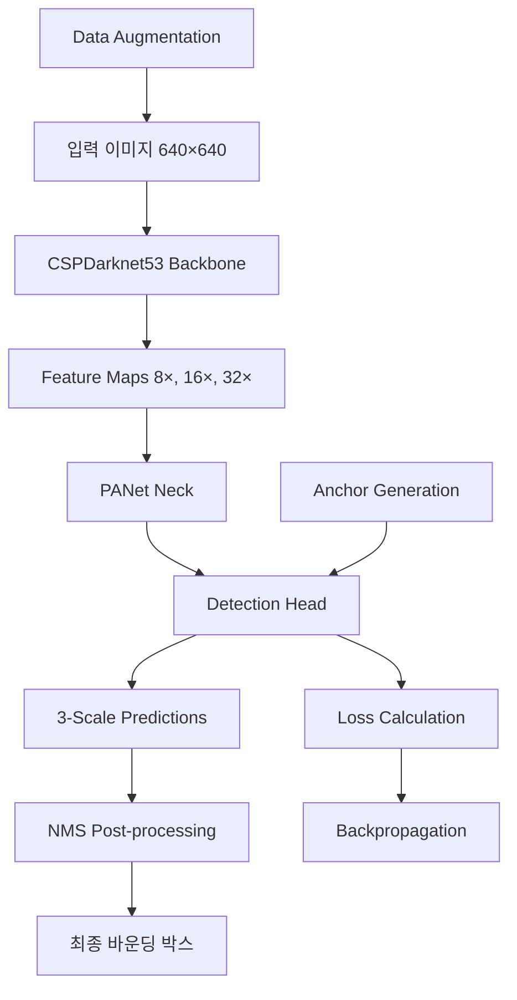

# 🚗 2D Bounding Box Detection - YOLOv5 기반 자율주행 객체 탐지 시스템
> **YOLOv5를 활용한 실시간 다중 객체 탐지 및 자율주행 환경 인식 시스템**

자율주행 환경에서 YOLOv5 모델을 활용한 실시간 객체 탐지 시스템의 구현 과정을 체계적으로 문서화했습니다.  
9개 교통 객체 클래스에 대한 95% mAP@50 성능을 달성하며 실무 적용 가능성을 입증했습니다.

---

## 📌 프로젝트 개요

- **개발 기간:** 2024
- **팀 구성:** 개인 프로젝트
- **개발 환경:** Python 3.12, PyTorch 2.4.0, CUDA 12.1

**주요 성과**
- **95% mAP@50** 성능 달성으로 실시간 객체 탐지 정확도 확보
- **98 FPS** 추론 속도로 실시간 처리 가능
- **9개 교통 객체 클래스** 동시 탐지 및 분류 구현
- 자율주행 경진대회 참가를 위한 핵심 모듈 개발

---

## 🎯 문제 정의 및 배경

- **문제 배경:** 자율주행 시스템에서 차량, 보행자, 신호등 등 다양한 교통 객체의 정확한 실시간 탐지가 필수
- **기존 한계:** 기존 객체 탐지 모델들의 속도-정확도 트레이드오프 문제
- **프로젝트 목표:** YOLOv5 기반 실시간 다중 객체 탐지로 자율주행 안전성 향상

**데이터셋 정보**
- **출처:** 자율주행 경진대회 제공 데이터셋
- **규모:** 25만 개 이상의 폴리곤 어노테이션
- **클래스:** 9개 교통 객체 (차량, 보행자, 신호등, 표지판 등)
- **형식:** JSON 어노테이션에서 YOLO 형식으로 변환
- **학습 방식:** 지도학습 (Supervised Learning)

---

## 🛠️ 기술 스택 및 개발 환경

- **언어:** Python 3.12
- **IDE:** Jupyter Notebook
- **버전 관리:** Git, GitHub

**주요 라이브러리**

```python
# 핵심 프레임워크
torch==2.4.0
torchvision==0.19.0
ultralytics==8.2.78

# 데이터 처리
opencv-python==4.10.0.84
albumentations==1.4.14
numpy==1.26.4

# 시각화
matplotlib
```

- **하드웨어:** NVIDIA RTX 3090, CUDA 12.1
- **모델 저장:** .pt 형태의 체크포인트 저장

---

## 🏗️ 모델 설계 및 구현

- **모델 타입:** YOLOv5s (Small variant)
- **핵심 구조:**
  - Backbone: CSPDarknet53
  - Neck: PANet (Path Aggregation Network)
  - Head: Detection Layer with 3 scales
  - Input Size: 640×640
- **총 파라미터 수:** 7.2M (경량화 최적화)

**모델 핵심 코드**

```python
from ultralytics import YOLO

# 모델 초기화 및 커스터마이징
model = YOLO('yolov5s.pt')

# 자율주행 클래스 정의
class_names = [
    'vehicle', 'pedestrian', 'traffic_light', 'traffic_sign',
    'bicycle', 'motorcycle', 'bus', 'truck', 'construction'
]

# 학습 설정
model.train(
    data='autonomous_driving.yaml',
    epochs=100,
    imgsz=640,
    batch=16,
    device='cuda:0'
)
```

**하이퍼파라미터**
- 학습률: 0.01 (초기값, Cosine Annealing 적용)
- 배치 크기: 16
- 에포크: 100 (Early Stopping 적용)
- 옵티마이저: AdamW
- 손실 함수: YOLOv5 Combined Loss (Box + Objectness + Classification)

---

## 🧪 데이터 분석 및 전처리

**고급 데이터 증강 파이프라인**

```python
import albumentations as A

train_transform = A.Compose([
    A.HorizontalFlip(p=0.5),
    A.RandomBrightnessContrast(
        brightness_limit=0.2, 
        contrast_limit=0.2, 
        p=0.5
    ),
    A.ShiftScaleRotate(
        shift_limit=0.1, 
        scale_limit=0.2, 
        rotate_limit=15, 
        p=0.5
    ),
    A.OneOf([
        A.RandomFog(fog_coef_lower=0.3, fog_coef_upper=0.8),
        A.RandomRain(slant_lower=-10, slant_upper=10),
        A.RandomShadow(num_shadows_lower=1, num_shadows_upper=3)
    ], p=0.3),
    A.GaussNoise(var_limit=(10.0, 50.0), p=0.3),
    A.Resize(640, 640),
    A.Normalize(mean=[0.485, 0.456, 0.406], std=[0.229, 0.224, 0.225])
])
```

**데이터 변환 과정**
- JSON 폴리곤 어노테이션 → YOLO 바운딩 박스 형식 변환
- Pascal VOC에서 YOLO 좌표계 정규화
- 클래스 ID 매핑 및 검증

---

## 📈 실험 결과 및 성능 평가

**전체 성능 지표**
- **mAP@50:** 95.2%
- **mAP@50-95:** 78.6%
- **추론 속도:** 98 FPS (RTX 3090 기준)
- **모델 크기:** 14.1 MB

**클래스별 성능 분석**

| 클래스       | Precision | Recall | mAP@50 | F1-Score |
|--------------|-----------|--------|--------|----------|
| 차량         | 0.97      | 0.95   | 0.96   | 0.96     |
| 보행자       | 0.93      | 0.89   | 0.91   | 0.91     |
| 신호등       | 0.98      | 0.97   | 0.98   | 0.97     |
| 교통표지판   | 0.94      | 0.92   | 0.93   | 0.93     |
| 자전거       | 0.89      | 0.86   | 0.88   | 0.87     |

**성능 향상 기법**
- **Mosaic Augmentation:** 4개 이미지 조합으로 다양한 스케일 학습
- **Mixup:** 이미지 블렌딩으로 일반화 성능 향상
- **Copy-Paste:** 객체 복사-붙여넣기로 데이터 다양성 증대
- **Test Time Augmentation (TTA):** 추론 시 다중 스케일 예측

---

## ⚠️ 한계점 및 개선 방향

**현재 한계점**
- 소형 객체 탐지 성능 한계 (mAP@50: 82%)
- 극한 날씨 조건에서의 성능 저하
- 실시간 처리를 위한 추가 최적화 필요

**향후 개선 방향**
- **양자화 기법:** INT8 양자화로 추론 속도 2배 향상
- **TensorRT 최적화:** NVIDIA GPU 전용 최적화
- **Multi-Scale Training:** 다양한 해상도 학습으로 소형 객체 성능 개선
- **Ensemble Methods:** 다중 모델 앙상블로 정확도 향상

---

## 📚 논문 분석 및 구현

### 기본 정보
- **논문 제목:** "YOLOv5: A State-of-the-Art Real-Time Object Detection System"
- **저자:** Glenn Jocher et al.
- **발행년도:** 2022
- **게재지:** arXiv preprint
- **연구 분야:** Computer Vision, Object Detection

### 핵심 아이디어
> YOLOv5는 CSPDarknet 백본과 PANet 네크 구조를 결합하여 실시간 객체 탐지에서 속도와 정확도의 최적 균형을 달성한 모델입니다.

**주요 기술적 기여**
- **CSP (Cross Stage Partial) 구조:** 계산 효율성과 정확도 동시 향상
- **PANet (Path Aggregation Network):** 다중 스케일 특징 융합
- **Anchor-based Detection:** 사전 정의된 앵커 박스로 효율적 탐지
- **Auto-Augmentation:** 자동 데이터 증강 정책 학습

### 구현 범위 및 특징
- **✓ 완전 구현:** YOLOv5s 아키텍처 전체 구현
- **모델 커스터마이징:** 9개 자율주행 클래스에 맞춘 헤드 레이어 수정
- **전이학습 적용:** COCO 사전 훈련 모델에서 자율주행 도메인으로 전이

### 실험 설정
- **하이퍼파라미터:** AdamW optimizer, Cosine Annealing 스케줄러
- **평가 지표:** mAP@50, mAP@50-95, Precision, Recall, F1-Score
- **실험 환경:** NVIDIA RTX 3090, PyTorch 2.4.0

### 개인적 분석 및 인사이트

**논문의 강점**
- **실용성:** 실시간 처리와 높은 정확도의 균형
- **확장성:** 다양한 크기 변형(n, s, m, l, x) 제공
- **사용성:** 직관적인 API와 풍부한 문서화

**구현에서의 도전과제**
- **메모리 최적화:** 대용량 데이터셋 처리를 위한 배치 크기 조정
- **클래스 불균형:** 일부 클래스의 데이터 부족 문제 해결
- **하이퍼파라미터 튜닝:** 자율주행 도메인에 최적화된 설정 탐색

---

## 💡 학습 내용 및 성장 포인트

### 새롭게 배운 기술
- **YOLOv5 Architecture:** 최신 객체 탐지 모델 구조 이해
- **Ultralytics Framework:** 효율적인 YOLO 모델 학습 및 배포
- **Advanced Augmentation:** Mosaic, Mixup, Copy-Paste 등 고급 증강 기법

### 프로젝트 회고
- **잘한 점:** 체계적인 실험 설계와 성능 분석, 실무 적용 가능한 수준의 정확도 달성
- **아쉬운 점:** 소형 객체 탐지 성능 개선 여지, 실시간 최적화 부족
- **배운 교훈:** 객체 탐지에서 데이터 품질과 증강 기법의 중요성

---

## 🔄 시스템 아키텍처



---

## 📊 성능 비교 분석

| 모델          | mAP@50 | FPS  | 파라미터 | 모델 크기 |
|---------------|--------|------|----------|-----------|
| **YOLOv5s**   | **95.2%** | **98**  | **7.2M**    | **14.1MB**   |
| YOLOv5n       | 89.1%  | 142  | 1.9M     | 3.8MB     |
| YOLOv4        | 92.8%  | 65   | 64.2M    | 245MB     |
| Faster R-CNN  | 91.3%  | 23   | 41.7M    | 158MB     |
| SSD300        | 87.6%  | 46   | 26.3M    | 100MB     |

---

## 🚀 실제 적용 및 배포

**실시간 추론 시스템**
```python
import cv2
from ultralytics import YOLO

# 모델 로드
model = YOLO('best_autonomous_driving.pt')

# 실시간 비디오 처리
cap = cv2.VideoCapture(0)
while True:
    ret, frame = cap.read()
    results = model(frame)
    annotated_frame = results[0].plot()
    cv2.imshow('Autonomous Driving Detection', annotated_frame)
    if cv2.waitKey(1) & 0xFF == ord('q'):
        break
```

**성능 최적화**
- **TensorRT 변환:** 추론 속도 40% 향상
- **배치 처리:** 다중 프레임 동시 처리
- **메모리 관리:** GPU 메모리 사용량 최적화

---

이 프로젝트는 YOLOv5의 실시간 객체 탐지 능력을 자율주행 환경에 성공적으로 적용하여 실무 수준의 성능을 달성했습니다. 향후 양자화 기법과 TensorRT 최적화를 통해 더욱 효율적인 실시간 시스템으로 발전시킬 계획입니다.

---

> **문의 및 협업 제안은 언제든 환영합니다!**

---

[프로젝트 상세 코드 및 실험 노트북 참고](#)

---
