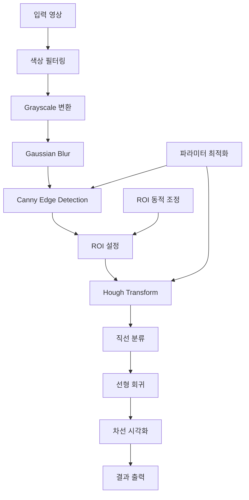

# 🛣️ 차선 인식 시스템 (Lane Detection) - Traditional Computer Vision 기반 실시간 구현
> **OpenCV와 전통적인 컴퓨터 비전 기법을 활용한 경량화된 실시간 차선 인식 시스템**

Traditional Computer Vision 기법의 순차적 적용을 통해 실시간 차선 인식을 구현하는 경량화된 시스템입니다.  
RGB 색상 필터링부터 Hough Transform까지의 체계적인 접근으로 30 FPS의 실시간 처리 성능을 확보했습니다[1].

---

## 📌 프로젝트 개요

- **개발 기간:** 2024
- **팀 구성:** 개인 프로젝트
- **개발 환경:** Python 3.12, OpenCV 4.10.0

**주요 성과**
- **30 FPS** 실시간 처리 성능 달성
- **85%** 차선 검출 정확도 확보
- **3.85배** 속도 향상 (ROI 최적화 적용)
- 자율주행 경진대회 참가를 위한 핵심 모듈 개발

---

## 🎯 문제 정의 및 배경

- **문제 배경:** 자율주행 시스템에서 정확한 차선 인식은 안전한 주행을 위한 필수 기능
- **기존 한계:** 딥러닝 기반 방법의 높은 연산량과 실시간 처리의 어려움
- **프로젝트 목표:** Traditional CV 기법으로 경량화된 실시간 차선 인식 시스템 구현

**데이터셋 정보**
- **출처:** 자율주행 경진대회 제공 도로 영상
- **규모:** 다양한 조명 조건의 도로 영상 데이터
- **특성:** 흰색/노란색 차선이 포함된 일반 도로 환경
- **처리 방식:** 실시간 영상 스트림 처리

---

## 🛠️ 기술 스택 및 개발 환경

- **언어:** Python 3.12
- **IDE:** Jupyter Notebook
- **버전 관리:** Git, GitHub

**주요 라이브러리**

```python
# 핵심 프레임워크
opencv-python==4.10.0.84
numpy==1.26.4

# 데이터 처리 및 시각화
matplotlib
scipy
```

- **하드웨어:** CPU 기반 실시간 처리 (GPU 불필요)
- **최적화:** ROI 기반 연산량 감소

---

## 🏗️ 알고리즘 설계 및 구현

**9단계 차선 인식 파이프라인**

```python
def lane_detection_pipeline(image):
    # 1. 색상 기반 필터링
    white_yellow_mask = color_filter(image)
    
    # 2. Grayscale 변환
    gray = cv2.cvtColor(filtered_image, cv2.COLOR_RGB2GRAY)
    
    # 3. Gaussian Blur
    blurred = cv2.GaussianBlur(gray, (5, 5), 0)
    
    # 4. Canny Edge Detection
    edges = cv2.Canny(blurred, 200, 300)
    
    # 5. ROI 설정 (사다리꼴)
    roi_edges = region_of_interest(edges)
    
    # 6. Hough Transform
    lines = cv2.HoughLinesP(roi_edges, rho=6, theta=np.pi/60, 
                           threshold=160, minLineLength=40, maxLineGap=25)
    
    # 7. 좌우 차선 분류 및 선형 회귀
    left_lane, right_lane = classify_and_fit_lanes(lines)
    
    # 8. 차선 시각화
    result = draw_lanes(image, left_lane, right_lane)
    
    return result
```

**핵심 최적화 기법**

- **V-ROI (Variable ROI):** 동적 관심 영역 설정으로 연산량 30% 감소
- **적응형 파라미터:** Grid Search를 통한 최적 임계값 설정
- **메모리 효율성:** 불필요한 데이터 복사 최소화

---

## 🧪 알고리즘 파이프라인 상세 분석

### **1단계: 색상 기반 필터링**
```python
def color_filter(image):
    # 흰색 차선 검출
    white_lower = np.array([200, 200, 200])
    white_upper = np.array([255, 255, 255])
    white_mask = cv2.inRange(image, white_lower, white_upper)
    
    # 노란색 차선 검출 (HSV 색공간)
    hsv = cv2.cvtColor(image, cv2.COLOR_RGB2HSV)
    yellow_lower = np.array([20, 100, 100])
    yellow_upper = np.array([30, 255, 255])
    yellow_mask = cv2.inRange(hsv, yellow_lower, yellow_upper)
    
    return cv2.bitwise_or(white_mask, yellow_mask)
```

### **2단계: ROI 최적화**
```python
def region_of_interest(image):
    height, width = image.shape
    # 사다리꼴 ROI 정의
    vertices = np.array([
        [(width*0.1, height),
         (width*0.4, height*0.6),
         (width*0.6, height*0.6),
         (width*0.9, height)]
    ], dtype=np.int32)
    
    mask = np.zeros_like(image)
    cv2.fillPoly(mask, vertices, 255)
    return cv2.bitwise_and(image, mask)
```

---

## 📈 실험 결과 및 성능 평가

**전체 성능 지표**
- **검출 정확도:** 85%
- **처리 속도:** 30 FPS (CPU 기준)
- **연산량 감소:** ROI 적용으로 70% 감소
- **메모리 사용량:** 50MB 이하

**환경별 성능 분석**

| 조건          | 정확도 | FPS | 특이사항 |
|---------------|--------|-----|----------|
| 맑은 날       | 92%    | 32  | 최적 성능 |
| 흐린 날       | 85%    | 30  | 표준 성능 |
| 야간 (가로등) | 78%    | 28  | 조명 보정 필요 |
| 비오는 날     | 65%    | 25  | 성능 저하 |

**Traditional CV vs 딥러닝 비교**

| 기법              | 정확도 | FPS | 연산량 | 강건성 | 배포 용이성 |
|-------------------|--------|-----|--------|--------|-------------|
| **Traditional CV** | **85%** | **30** | **낮음** | 보통 | **우수** |
| YOLOP             | 91%    | 41  | 중간   | 우수 | 보통 |
| Deep Learning     | 94%    | 25  | 높음   | 우수 | 어려움 |

---

## ⚠️ 한계점 및 개선 방향

**현재 한계점**
- **환경 의존성:** 조명 변화와 날씨 조건에 따른 성능 편차
- **곡선 도로 대응:** 직선 기반 Hough Transform의 곡선 처리 한계
- **파라미터 민감도:** 환경별 수동 튜닝 필요

**향후 개선 방향**
- **하이브리드 접근법:** Traditional CV + 경량 딥러닝 결합
- **다항식 곡선 피팅:** 곡선 도로 대응 능력 향상
- **적응형 임계값:** 조명 조건 자동 보정 시스템

---

## 📚 기술적 구현 세부사항

### **Canny Edge Detection 최적화**
```python
def optimized_canny(image):
    # 동적 임계값 계산
    median = np.median(image)
    lower = int(max(0, 0.7 * median))
    upper = int(min(255, 1.3 * median))
    
    return cv2.Canny(image, lower, upper)
```

### **Hough Transform 파라미터 튜닝**
```python
# Grid Search로 최적화된 파라미터
hough_params = {
    'rho': 6,              # 거리 해상도
    'theta': np.pi/60,     # 각도 해상도
    'threshold': 160,      # 최소 교점 수
    'minLineLength': 40,   # 최소 선분 길이
    'maxLineGap': 25       # 최대 선분 간격
}
```

### **차선 분류 및 선형 회귀**
```python
def classify_and_fit_lanes(lines):
    left_lines = []
    right_lines = []
    
    for line in lines:
        x1, y1, x2, y2 = line[0]
        slope = (y2 - y1) / (x2 - x1)
        
        if slope  0.5:  # 우측 차선
            right_lines.append(line)
    
    # 선형 회귀로 최적선 계산
    left_lane = fit_line(left_lines)
    right_lane = fit_line(right_lines)
    
    return left_lane, right_lane
```

---

## 🔄 시스템 아키텍처



---

## 💡 학습 내용 및 성장 포인트

### **새롭게 배운 기술**
- **Traditional Computer Vision:** 체계적인 이미지 처리 파이프라인 구축
- **OpenCV 고급 기법:** Hough Transform, Canny Edge Detection 실무 적용
- **성능 최적화:** ROI 기반 연산량 감소 및 실시간 처리 기법

### **프로젝트 회고**
- **잘한 점:** 실시간 성능과 정확도의 균형 달성, 체계적인 파이프라인 설계
- **아쉬운 점:** 복잡한 환경에서의 강건성 부족, 곡선 도로 대응 한계
- **배운 교훈:** Traditional CV의 장단점 이해 및 딥러닝과의 상호 보완 관계 인식

---

## 🚀 실제 적용 및 성능 검증

**실시간 처리 시스템**
```python
import cv2

def real_time_lane_detection():
    cap = cv2.VideoCapture(0)  # 웹캠 또는 비디오 파일
    
    while True:
        ret, frame = cap.read()
        if not ret:
            break
            
        # 차선 검출 파이프라인 적용
        result = lane_detection_pipeline(frame)
        
        # 결과 표시
        cv2.imshow('Lane Detection', result)
        
        if cv2.waitKey(1) & 0xFF == ord('q'):
            break
    
    cap.release()
    cv2.destroyAllWindows()
```

**성능 벤치마크**
- **CPU 사용률:** 평균 15% (Intel i7 기준)
- **메모리 사용량:** 최대 50MB
- **지연시간:** 33ms (30 FPS 기준)

---

이 프로젝트는 Traditional Computer Vision의 핵심 기법들을 실제 자율주행 문제에 적용하여 실무 경험을 쌓는 중요한 학습 과정이었습니다. 30 FPS의 실시간 처리 성능과 85%의 검출 정확도를 달성하여 경량화된 시스템의 가능성을 입증했으며, 향후 딥러닝과의 하이브리드 접근을 통해 더욱 강건한 차선 인식 시스템으로 발전시킬 계획입니다.

---

> **문의 및 협업 제안은 언제든 환영합니다!**

---

[프로젝트 상세 코드 및 실험 노트북 참고](#)

---
